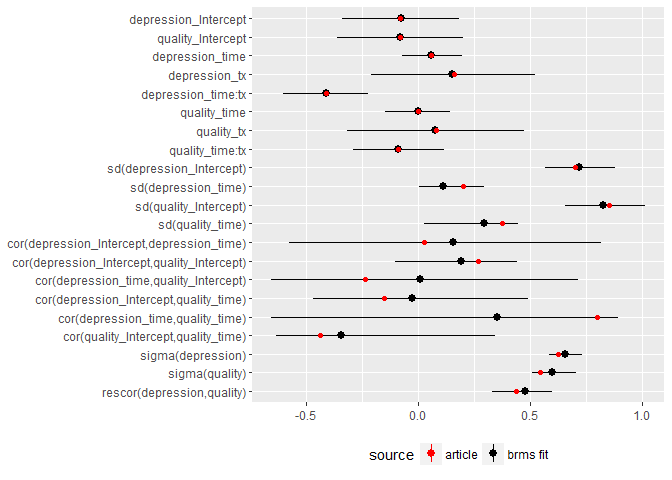

Multivariate, muliple-outcome mixed effects model
================
TJ Mahr
May 18, 2017

I've been trying to fit a multivariate mixed effects model, as described in [this article](https://www.ncbi.nlm.nih.gov/pmc/articles/PMC4119868/) using pure Stan code. The article has dummy example of this kind of model that I am using to validate candidate models.

``` r
library(dplyr)
library(readr)
library(brms)
library(rstan)
options(mc.cores = parallel::detectCores())

d <- read_csv("./data/NIHMS557790-supplement-Dataset_long_format.csv")
dwide <- d %>% 
  mutate(outcome = ifelse(var == 1, "depression", "quality")) %>% 
  select(pid:y, outcome) %>% 
  tidyr::spread(outcome, y)
dwide
#> # A tibble: 300 × 5
#>      pid  time    tx depression    quality
#> *  <int> <int> <int>      <dbl>      <dbl>
#> 1      1     0     1 -0.2978110 -0.1263426
#> 2      1     1     1  0.1500274 -0.1459226
#> 3      1     2     1 -0.2254487  0.8347519
#> 4      2     0     1 -2.2068290 -1.1174950
#> 5      2     1     1 -1.4847800 -0.3372014
#> 6      2     2     1 -2.5133370 -0.0778228
#> 7      3     0     1  0.1776886 -1.0550710
#> 8      3     1     1  0.9107191 -1.3366160
#> 9      3     2     1 -0.7120996 -0.8524922
#> 10     4     0     1 -0.2974198  0.4253734
#> # ... with 290 more rows
```

But it turns out to be trivial in brms.

Fit the model:

``` r
model <- brm(
  cbind(depression, quality) ~ time * tx + (time | 2 | pid), 
  data = dwide, iter = 10000, 
  save_dso = TRUE, 
  save_model = "model.stan")
```

Here's the fit.

``` r
model
#>  Family: gaussian(identity) 
#> Formula: cbind(depression, quality) ~ time * tx + (time | 2 | pid) 
#>    Data: dwide (Number of observations: 300) 
#> Samples: 4 chains, each with iter = 10000; warmup = 5000; thin = 1; 
#>          total post-warmup samples = 20000
#>    WAIC: Not computed
#>  
#> Group-Level Effects: 
#> ~pid (Number of levels: 100) 
#>                                             Estimate Est.Error l-95% CI
#> sd(depression_Intercept)                        0.72      0.08     0.57
#> sd(depression_time)                             0.12      0.08     0.01
#> sd(quality_Intercept)                           0.83      0.09     0.66
#> sd(quality_time)                                0.28      0.11     0.03
#> cor(depression_Intercept,depression_time)       0.16      0.36    -0.58
#> cor(depression_Intercept,quality_Intercept)     0.19      0.14    -0.10
#> cor(depression_time,quality_Intercept)          0.02      0.36    -0.65
#> cor(depression_Intercept,quality_time)         -0.02      0.24    -0.47
#> cor(depression_time,quality_time)               0.28      0.42    -0.66
#> cor(quality_Intercept,quality_time)            -0.30      0.24    -0.63
#>                                             u-95% CI Eff.Sample Rhat
#> sd(depression_Intercept)                        0.88       8047 1.00
#> sd(depression_time)                             0.30       1609 1.00
#> sd(quality_Intercept)                           1.02       2566 1.00
#> sd(quality_time)                                0.45        942 1.00
#> cor(depression_Intercept,depression_time)       0.82      10294 1.00
#> cor(depression_Intercept,quality_Intercept)     0.44       1638 1.00
#> cor(depression_time,quality_Intercept)          0.72        381 1.02
#> cor(depression_Intercept,quality_time)          0.49       5289 1.00
#> cor(depression_time,quality_time)               0.89       1096 1.01
#> cor(quality_Intercept,quality_time)             0.35       2561 1.00
#> 
#> Population-Level Effects: 
#>                      Estimate Est.Error l-95% CI u-95% CI Eff.Sample Rhat
#> depression_Intercept    -0.08      0.13    -0.34     0.18       7050    1
#> quality_Intercept       -0.08      0.14    -0.36     0.20       9144    1
#> depression_time          0.06      0.07    -0.07     0.20      15313    1
#> depression_tx            0.15      0.19    -0.21     0.52       7125    1
#> depression_time:tx      -0.41      0.10    -0.60    -0.22      14367    1
#> quality_time             0.00      0.07    -0.14     0.14      11885    1
#> quality_tx               0.08      0.20    -0.32     0.47       9188    1
#> quality_time:tx         -0.09      0.10    -0.29     0.12      11844    1
#> 
#> Family Specific Parameters: 
#>                            Estimate Est.Error l-95% CI u-95% CI Eff.Sample
#> sigma(depression)              0.66      0.04     0.58     0.73       5008
#> sigma(quality)                 0.60      0.05     0.51     0.71       1384
#> rescor(depression,quality)     0.48      0.07     0.33     0.60       4233
#>                            Rhat
#> sigma(depression)             1
#> sigma(quality)                1
#> rescor(depression,quality)    1
#> 
#> Samples were drawn using sampling(NUTS). For each parameter, Eff.Sample 
#> is a crude measure of effective sample size, and Rhat is the potential 
#> scale reduction factor on split chains (at convergence, Rhat = 1).
```

Load up the results from the table in the paper.

``` r
paper <- list(
  "depression_Intercept" = −.08,
  "depression_time" = .06, 
  "depression_tx"   =   .16,
  "depression_time:tx" = −.41,
  
  "quality_Intercept"   = −.08,
  "quality_time"    = .002,
  "quality_tx"  = .08,
  "quality_time:tx" = −.09,
  
  "sd(depression_Intercept)" = sqrt(.49),
  "sd(depression_time)" = sqrt(.04),
  # "cov(depression_Intercept,depression_time)" = .004,
  "cor(depression_Intercept,depression_time)" = .004 / (sqrt(.49) * sqrt(.04)),
  
  "sd(quality_Intercept)" = sqrt(.73),
  "sd(quality_time)" =  sqrt(.14),
  # "cov(quality_Intercept,quality_time)" = −.14,
  "cor(quality_Intercept,quality_time)" = −.14 / (sqrt(.73) * sqrt(.14)),
  
  # "cov(depression_Intercept,quality_Intercept)"   = .16,
  "cor(depression_Intercept,quality_Intercept)" = .16 / (sqrt(.49) * sqrt(.73)),
  # "cov(depression_Intercept,quality_time)" =  −.04,
  "cor(depression_Intercept,quality_time)" =    −.04 / (sqrt(.49) * sqrt(.14)),
  # "cov(depression_time,quality_Intercept)" = −.04,
  "cor(depression_time,quality_Intercept)" = −.04 / (sqrt(.04) * sqrt(.73)),
  # "cov(depression_time,quality_time)" = .06,
  "cor(depression_time,quality_time)"   = .06 / (sqrt(.04) * sqrt(.14)),
  
  "sigma(depression)" = sqrt(.39),
  "sigma(quality)" = sqrt(.30),
  # "cov(depression,quality)" = .15,
  "rescor(depression,quality)" =    .15 / (sqrt(.39) * sqrt(.30))
)
```

Some junk to clean up the column names

``` r
df <- as.data.frame(model)
names(df) <- names(as.data.frame(model)) %>% 
  stringr::str_replace("time.tx", "time:tx") %>% 
  stringr::str_replace("^b_", "") %>% 
  stringr::str_replace("^sd(.+)$", "sd(\\1)") %>% 
  stringr::str_replace("^cor(.+)$", "cor(\\1)") %>% 
  stringr::str_replace("^rescor(.+)$", "rescor(\\1)") %>% 
  stringr::str_replace("^sigma_(.+)$", "sigma(\\1)") %>% 
  stringr::str_replace("pid", "") %>% 
  stringr::str_replace("[(]_+", "(") %>% 
  stringr::str_replace("__+", ",")
df <- df %>% select(1:21)  %>% tibble::as.tibble()
```

Compare the MLE and MCMC estimates!

``` r
ordering <- names(df)
dfl <- df %>% tidyr::gather(parameter, value)
paper_df <- tibble::enframe(paper, name = "parameter") %>% 
  tidyr::unnest(value)

library(ggplot2)
ggplot(dfl) + 
  aes(x = factor(parameter, levels = rev(ordering)), y = value) + 
  stat_summary(aes(color = "brms fit"), fun.data = median_hilow,  
               fun.args = list(conf.int = .95)) + 
  geom_point(aes(color = "article"), data = paper_df) + 
  coord_flip() + 
  scale_color_manual(values  = c("red", "black")) + 
  labs(y = NULL, x = NULL, colour = "source") + 
  theme(legend.position = "bottom")
```


